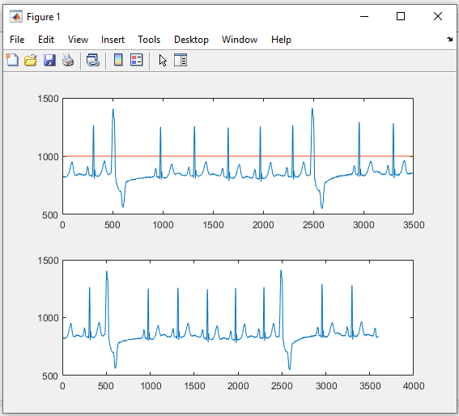
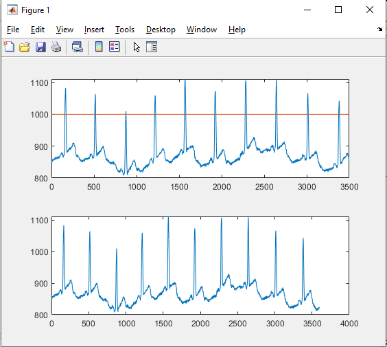

# Matlab ECG project
ECG project to display sample data to calculate beats/min

## How to use 
cole repo and run following command
```bash
ECG_Project
```
## Current progress
Graph for sample data 1

Graph for sample data 2
