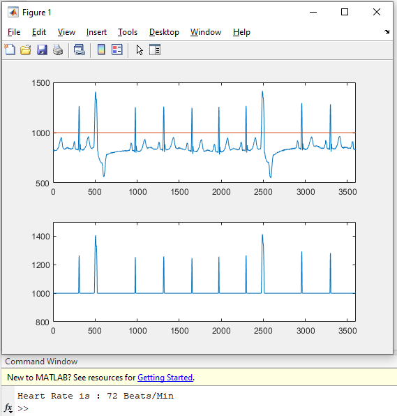

# Matlab ECG project
ECG project to display sample data to calculate beats/min

[]

## How to use 
cole repo and run following command
```bash
ECG_Project
```

## Current progress
1. Graph for sample data 1


2. Graph for sample data 2


## Final
Final output after processing and calulating beats per minute
Graph for sample data 2

